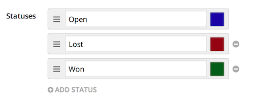

Statuses are a helpful way to label and organize responses. You can configure your own statuses according to the needs of your project. For example, the "Apps Contest" demo project uses three statuses ("Open," "Lost," or "Won") to designate the current state of each contest entry (response).

## Managing statuses

You can define the statuses for your project when you create your project initially, but you can also configure and manage statuses after the project has been created. Click "Edit Project" and select "Statuses" from the project checklist on the right-hand side to manage your statuses. It should look something like this (though the names, and colors of the statuses in your project will probably be different):

You can assign any name and color to each status. Simply click on either the name or the color to change it. To add a new status, click the "Add Status" button below the list of statuses.

## Assigning responses to statuses

Once you have the statuses in your project configured, you can set the status of each individual response. You can assign a status to a response from the "Responses" table by checking the box next to a response and clicking the "Status" dropdown above the table.

You can also assign a response from an individual response page by clicking on the "Status" dropdown at the top of the right-hand sidebar.

## Filtering responses by status

To filter responses by status, just click on a status on the left-hand side of the responses table.

---

## What happens when I destroy a status?
When a status is destroyed, any responses that were assigned to that status are re-assigned to the first status in the list.

## Why can't I destroy my status?
You must always have at least one status that serves as a default status.

## What's the difference between statuses and labels?
Responses always have exactly one status, but can have multiple labels. For example, a response's *status* could be either "Open" or "Closed," but it could be *labeled* as both "Interesting" and "Practical."
