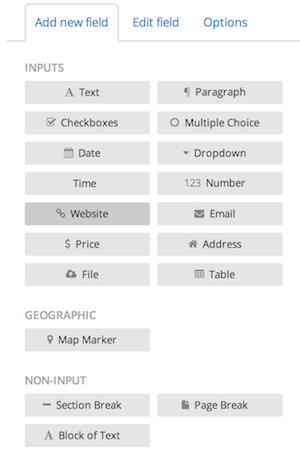
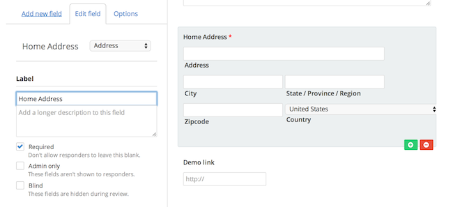

## Building your form

At the heart of your project is your response form. You can create your form when you make your project, but you can also always go back and edit your form by clicking "Edit project" and selecting "Response form" from the "Project checklist."

### Adding new fields

To add a new field to your form, click the "Add new field" tab on the left-hand side of the form builder. Then, just select the appropriate field type (for example, "Address" if you would like to collect address information from your responders) to add it to your form. Once form fields have been added, you can always drag-and-drop to change their order within the form.

### Editing fields

To edit a field, first select it from the list of response fields. Notice that the selected field's background is darker, and that the edit options for that field appear on the left-hand side of the page. When you edit a field's name, description, or configuration options, the results of your edits are reflected immediately.

### Copying fields

To copy an existing field, click the green "+" icon that appears when you move your mouse over the field.

### Deleting fields

To delete an existing field, click the red "-" icon that appears when you move your mouse over the field. You will prompted to confirm that you want to delete this response field. Note that deleting a field will also remove any submitted responses to that field.

## Admin-only fields

To make a field admin-only, select it and click the "Edit field" tab. Then, check the box next to "Admin only." Admin-only fields will not be shown to responders, but they can be used for keeping track of admin-only response information.

## Blind fields

To make a field blind, select it and click the "Edit field" tab. Then, check the box next to "Blind." Blind fields will not be shown to evaluators during the review process.
